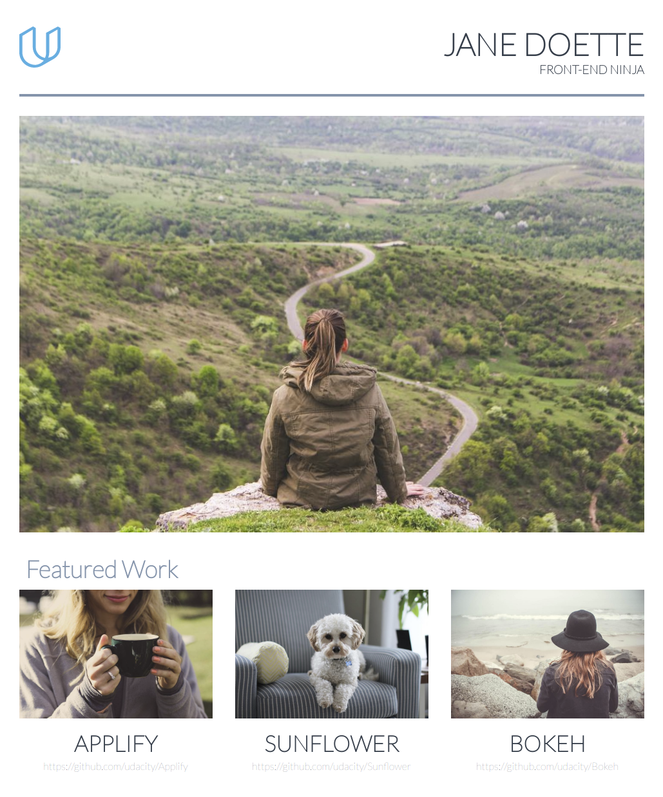

# Portfolio Website

This is a portfolio website created during the Udacity Fullstack Web Developer Program

<div align="center">
  <br><br>
</div>

## Getting Started

These instructions will get you a copy of the project up and running on your local machine.

### Installing

Make a copy of the repository:

```bash
git clone https://github.com/henkeldi/ud036-task-2.git
```

### Running the program

Open `index.html` inside your browser.